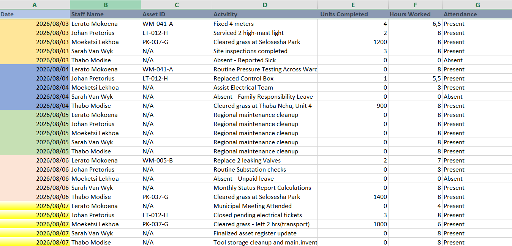
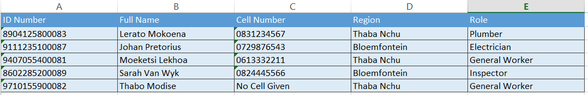

# Mangaung_EPWP_Data_Capture_Tool
A professional EPWP data capturing and transformation project for the Mangaung Metropolitan Municipality. Demonstrates advanced Excel data cleaning, text-casing standardization, ISO date formatting, and administrative formula optimization to transform messy raw field logs into audit-ready relational data tabs.

# Mangaung EPWP Data Capture & Compliance Tool

A professional data capturing and transformation project simulating public sector operational reporting for the Mangaung Metropolitan Municipality (Bloemfontein & Thaba Nchu regions). 

## 📊 Project Overview
This repository contains the end-to-end transformation of unverified, inconsistent raw field notes into a structured, audit-ready relational spreadsheet tool.

## 📌 Data Source
* **Source:** Simulated Expanded Public Works Programme (EPWP) regional field logs for the Mangaung Metropolitan Municipality.
* **Context:** Generated for professional administrative practice to mimic real-world municipal operational data formats, capturing daily logs for Water Meters, High-Mast Lighting, and Public Parks Maintenance.

## 🛠️ Data Tasks Performed
* **Data Cleaning & Standardization:** Transformed messy raw text notes into a clean relational schema across three distinct sheets (Assets, Staff Directory, and Job Cards).
* **Data Integrity Management:** Implemented strict proper text-casing, forced ISO date formatting, and resolved missing South African mobile country identifiers/leading zeros without sacrificing numerical parsing fields.
* **Formula Compliance Optimization:** Structured discrete columns isolating operational metrics (Units, Hours) from textual annotations to preserve administrative formula execution.

## 📁 Files in this Repository
1. `Mangaung_Raw_Field_Data.txt` - The original messy field log document.
2. `Mangaung_EPWP_Data_Capture_Tool.xlsx` - The finished, standardized 3-tab workbook.

## 📊 Visual Proof / Spreadsheet Preview

### 1. Job Cards Operational Log

### 2. Assets & Regional Infrastructure Tracking

### 3. Staff Directory & Validation Data

