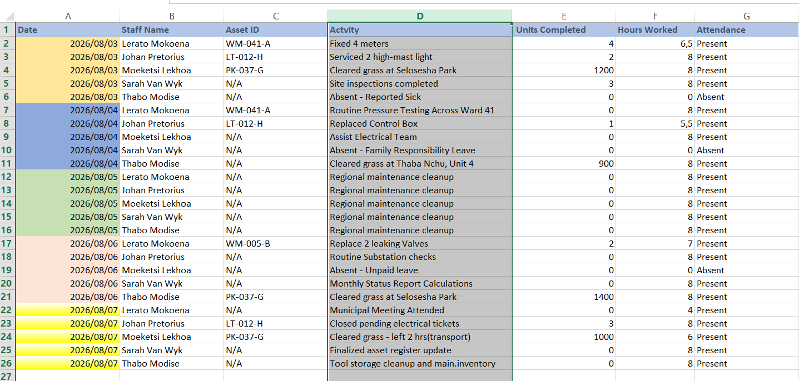
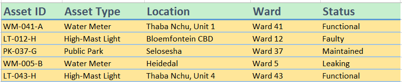
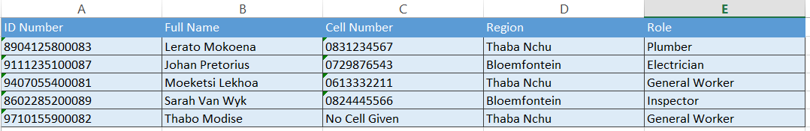

# Mangaung_EPWP_Data_Capture_Tool

An Excel data-cleaning project using simulated EPWP field logs modelled on Mangaung Metropolitan Municipality operations, turning messy raw notes into a structured three-tab workbook. 

## 📊 Project Overview
This repository contains the transformation of unverified, inconsistent raw field notes (Bloemfontein & Thaba Nchu regions) into a structured, organised Excel workbook.

## 📌 Data Source
* **Source:** Simulated Expanded Public Works Programme (EPWP) regional field logs for the Mangaung Metropolitan Municipality.
* **Context:** Generated for administrative practice to mimic real-world municipal operational data formats, capturing daily logs for Water Meters, High-Mast Lighting, and Public Parks Maintenance.

## 🛠️ Data Tasks Performed
* **Data Cleaning & Standardisation:** Transformed messy raw text notes into three organised sheets (Assets, Staff Directory, and Job Cards).
* **Data Integrity Management:** Applied consistent text casing, consistent YYYY/MM/DD date formatting, and restored leading zeros on phone numbers.
* **Formula-Ready Columns:** Structured discrete columns isolating operational metrics (Units, Hours) from textual annotations to preserve administrative formula execution.

## 📁 Files in this Repository
1. `Mangaung_Raw_Field_Data.txt` - The original messy field log document.
2. `Mangaung_EPWP_Data_Capture_Tool.xlsx` - The finished, standardised three-tab workbook.

## 📊 Visual Proof / Spreadsheet Preview

### 1. Job Cards Operational Log

### 2. Assets & Regional Infrastructure Tracking

### 3. Staff Directory

